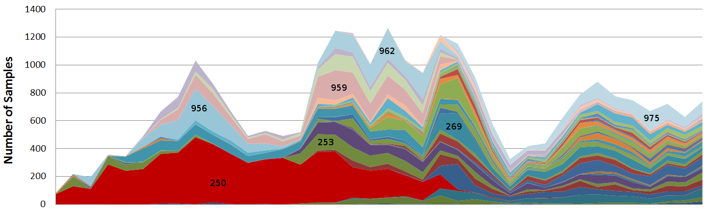
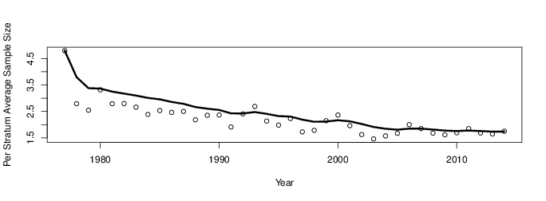

##Abstract
In order to effectively manage exploited populations, accurate estimates of 
commercial fisheries catches are necessary to inform monitoring and assessment 
efforts. 
In California, the high degree of heterogeneity in the species composition of 
many groundfish fisheries, particularly those targeting rockfish (*Sebastes*), 
leads to challenges in sampling all market categories, or species, adequately. 
Limited resources and increasingly complex stratification of the sampling 
system inevitably leads to gaps in sample data. In the presence of sampling 
gaps, ad-hoc point estimation is currently obtained according to historically 
derived "data borrowing" protocols which do not allow for tractable 
uncertainty estimation. 
In order to move from the current, but admittedly rigid sampling design, we 
have continued previous exploratory efforts to develop, and apply, Bayesian 
hierarchical models of the landing data to estimate species compositions. 
Furthermore, we introduce a formalized method for discovering consistent 
"borrowing" strategies across overstratified data. 
Our results indicate that this approach is likely to be more robust than the 
current system, particularly in the face of sparse sampling. Additionally, our 
method should also help inform, and prioritize, future sampling efforts. 
Perhaps more significantly, this approach provides estimates of uncertainty 
around species-specific catch estimates.

<!-- 
pandoc -o methodsPaper.html methodsPaper.md --webtex
pandoc -o methodsPaper.pdf methodsPaper.md --webtex
pandoc -o methodsPaper.docx methodsPaper.md --webtex
-->

#Introduction
* Data
* Stratification Pictures

#Methods

Define the following notation for condensing the definition of the model: 
$$\{x\}^{(1,...,n)}_{i_1,...,i_n} \sim N\Big(0, v^{\{x\}^{(1,...,n)}}\Big) = x^{(1)}_{i_1} \sim N\Big(0, v^{x^{(1)}}\Big),...,~ x^{(n)}_{i_n} \sim N\Big(0, v^{x^{(n)}}\Big)$$

$$j \in \{1, ..., J\} ~~~ Species$$
$$k \in \{1, ..., K\} ~~~ Ports$$
$$l \in \{1, ..., L\} ~~~ Gears$$
$$m \in \{1, ..., M\} ~~~ Years$$
$$\eta \in \{1, ..., H\} ~~~ Quarters$$

$$y_{ijklm\eta} \sim NB\Big(\exp(\theta_{jklm\eta}),~\exp(\psi)\Big)$$
$$\theta_{jklm\eta} = \beta_0 + a_{jklm\eta} + b_{jklm\eta}$$

$$a_{jklm\eta} = a^{(1)}_j + a^{(2)}_k + a^{(3)}_l + a^{(4)}_m + a^{(5)}_\eta$$
$$b_{jklm\eta} = b^{(1)}_{kj} + b^{(2)}_{kl} + b^{(3)}_{km} + b^{(4)}_{k\eta}$$

$$\psi \sim N\Big(0,~10^4\Big)$$
$$\beta_0 \sim N\Big(0,~10^4\Big)$$
$$\{a\}^{(1,2,3)}_{j,k,l} \sim N\Big(0,~10^4\Big)$$
$$\{a\}^{(4,5)}_{m,\eta} \sim N\Big(0,~v^{\{a\}^{(4, 5)}}\Big)$$
$$\{b\}^{(1,2,3,4)}_{kj,kl,km, k\eta} \sim N\Big(0,~v^{\{b\}^{(1,2,3,4)}}\Big)$$
$$v\sim IG(1,~10^5) ~~~ \forall ~~~ v$$

<!--
$$\{x\}^{(1,2,...,n)}_{i_1,i_2,...,i_n} = x^{(1)}_{i_1}, x^{(2)}_{i_2},..., x^{(n)}_{i_n}$$
$$\{x\}^{(1,2,...,n)} = x^{(1)}, x^{(2)},..., x^{(n)}$$
-->

Define the following notation for condensing the definition of the model: 
$$\Bigg\{x^{(k)}_{j^{(k)}} \sim N\Big(0, v^{(i)}\Big)\Bigg\}^{n}_{k=1} = x^{(1)}_{j^{(1)}} \sim N\Big(0, v^{(1)}\Big),...,~ x^{(n)}_{j^{(n)}} \sim N\Big(0, v^{(n)}\Big)$$

$$j^{(1)} \in \{1, ..., J^{(1)}\} ~~~ Ports$$
$$j^{(2)} \in \{1, ..., J^{(2)}\} ~~~ Quarters$$
$$j^{(3)} \in \{1, ..., J^{(4)}\} ~~~ Years$$
$$j^{(4)} \in \{1, ..., J^{(3)}\} ~~~ Gears$$
$$j^{(5)} \in \{1, ..., J^{(1)}\} ~~~ Species$$

$$y_{ij^{(1)}j^{(2)}j^{(3)}j^{(4)}j^{(5)}} \sim NB\Big(\exp(\theta_{j^{(1)}j^{(2)}j^{(3)}j^{(4)}j^{(5)}}),~\exp(\psi)\Big)$$
$$\theta_{j^{(1)}j^{(2)}j^{(3)}j^{(4)}j^{(5)}} = \beta_0 + a_{j^{(1)}j^{(2)}j^{(3)}j^{(4)}j^{(5)}} + b_{j^{(1)}j^{(2)}j^{(3)}j^{(4)}j^{(5)}}$$

$$a_{j^{(1)}j^{(2)}j^{(3)}j^{(4)}j^{(5)}} = a^{(1)}_{j^{(1)}} + a^{(2)}_{j^{(2)}} + a^{(3)}_{j^{(3)}} + a^{(4)}_{j^{(4)}} + a^{(5)}_{j^{(5)}}$$
$$=\sum_{k=1}^{5}a^{(k)}_{j^{(k)}}$$
$$b_{j^{(1)}j^{(2)}j^{(3)}j^{(4)}j^{(5)}} = b^{(1, 2)}_{j^{(1)}j^{(2)}} + b^{(1, 3)}_{j^{(1)}j^{(3)}} + b^{(1, 4)}_{j^{(1)}j^{(4)}} + b^{(1, 5)}_{j^{(1)}j^{(5)}}   +   b^{(2, 3)}_{j^{(2)}j^{(3)}} + b^{(2, 4)}_{j^{(2)}j^{(4)}} + b^{(2, 5)}_{j^{(2)}j^{(5)}}$$ 
$$= \sum_{k=2}^{5} b^{(1, k)}_{j^{(1)}j^{(k)}} + \sum_{l=3}^{5} b^{(2, l)}_{j^{(2)}j^{(l)}}$$
$$= \sum_{k=1}^{2}\sum_{l=k+1}^{5} b^{(k, l)}_{j^{(k)}j^{(l)}}$$

$$y_{ij^{(1)}j^{(2)}j^{(3)}j^{(4)}j^{(5)}} \sim NB\Big(\exp(\boldsymbol{\theta}),~\exp(\psi)\Big)$$
$$\boldsymbol{\theta} = \beta_0 + \sum_{k=1}^{5}a^{(k)}_{j^{(k)}} + \sum_{k=1}^{2}\sum_{l=k+1}^{5} b^{(k, l)}_{j^{(k)}j^{(l)}}$$

$$\psi \sim N\Big(0,~10^4\Big)$$
$$\beta_0 \sim N\Big(0,~10^4\Big)$$
$$\Bigg\{a^{(k)}_{j^{(k)}} \sim N\Big(0,~10^4\Big)\Bigg\}^{3}_{k=1}$$
$$\Bigg\{a^{(k)}_{j^{(k)}} \sim N\Big(0,~v^{(k)}\Big)\Bigg\}^{5}_{k=4}$$
$$\Bigg\{\Bigg\{b^{(1, k)}_{j^{(1)}j^{(k)}} \sim N\Big(0,~v^{(1, k)}\Big)\Bigg\}^{5}_{k=2},~\Bigg\{b^{(2, l)}_{j^{(2)}j^{(l)}} \sim N\Big(0,~v^{(2, l)}\Big)\Bigg\}^{5}_{l=3}\Bigg\}$$
$$=\Bigg\{\Bigg\{b^{(k, l)}_{j^{(k)}j^{(l)}} \sim N\Big(0,~v^{(k, l)}\Big)\Bigg\}^{5}_{l=k+1}\Bigg\}^{2}_{k=1}$$
$$v\sim IG(1,~10^5) ~~~ \forall ~~~ v$$

* Model (likelyhood/prior)
	* Overdispersion (Poisson Ole paper)
	* Heirarchy (sharing)
		* ??$v^{-1/2}\sim Unif(0,~Big) ~~~ \forall ~~~ v$??
		* ??$v^{-1/2}\sim Half-Cauchy ~~~ \forall ~~~ v$??
	* Graphical Model
	* INLA

* Predictive
	* species composition
	* species landing expansion
* Model Selection (Borrowing)
	* Port/??Qtr??
		* ??Combinatorics??Abstract
	* WAIC/MSE
		* predictive performance
		* $MSE(\hat\theta) = Var(\hat\theta)^2 + Bias(\hat\theta, \theta)^2$

#Results
* Bar plot picture
* Predictive Performance
* Sample/sample generating structure availiablity ??abstract??

#Discussion
* The Good
* The Bad
* The Ugly
* Moving Forward

