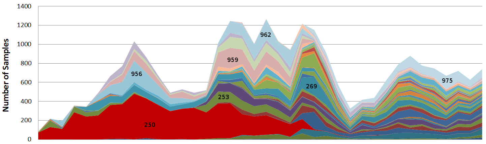

##Abstract
In order to effectively manage exploited populations, accurate estimates of 
commercial fisheries catches are necessary to inform monitoring and assessment 
efforts. 
In California, the high degree of heterogeneity in the species composition of 
many groundfish fisheries, particularly those targeting rockfish (*Sebastes*), 
leads to challenges in sampling all market categories, or species, adequately. 
Limited resources and increasingly complex stratification of the sampling 
system inevitably leads to gaps in sample data. In the presence of sampling 
gaps, ad-hoc point estimation is currently obtained according to historically 
derived "data borrowing" protocols which do not allow for tractable 
uncertainty estimation. 
In order to move from the current, but admittedly rigid sampling design, we 
have continued previous exploratory efforts to develop, and apply, Bayesian 
hierarchical models of the landing data to estimate species compositions. 
Furthermore, we introduce a formalized method for discovering consistent 
"borrowing" strategies across overstratified data. 
Our results indicate that this approach is likely to be more robust than the 
current system, particularly in the face of sparse sampling. Additionally, our 
method should also help inform, and prioritize, future sampling efforts. 
Perhaps more significantly, this approach provides estimates of uncertainty 
around species-specific catch estimates.

<!-- 
pandoc -o methodsPaper.html methodsPaper.md --webtex
pandoc -o methodsPaper.pdf methodsPaper.md --webtex
pandoc -o methodsPaper.docx methodsPaper.md --webtex
-->

#Introduction
* Data
* Stratification Pictures

#Methods

Given the complexity of these data, and thus the complexity of the modeling  
challenge that they present, it is neccisary to define a few notational 
conventions for representing such a model. 
In an attempt to conserve symbols, and hopefully reveal structure,$\left.\right.^{(.)}$ 
is used as a superscript on variable, or index, symbols to indicate 
a new symbol of the sort.
For example, $a^{(1)}$ represents the first subclass of a class of $a$ 
variables, $j^{(1)}$ represents a the first of a class of $j$ indecies, 
and thus $a^{(1)}_{j^{(1)}}$ represents the ${j^{(1)}}^{th}$ variable of the 
first subclass of $a$ variables.
Additionally, $\{.\}_\Omega$ is used as notation for condensing repeated structures within  
the overall model, where $\Omega$ represents indexing directions over some set. 
For example: 
$$\Bigg\{x^{(k)}_{j^{(k)}} \sim N\Big(0, v^{(k)}\Big)\Bigg\}_{k\in\{1, ..., m\}} = x^{(1)}_{j^{(1)}} \sim N\Big(0, v^{(1)}\Big),...,~ x^{(m)}_{j^{(m)}} \sim N\Big(0, v^{(m)}\Big)$$

Introduce model.
Check hyperprior values. maybe use c notiation?

------- ---------------------------------
Species $j^{(1)} \in \{1, ..., J^{(1)}\}$
Gear    $j^{(2)} \in \{1, ..., J^{(2)}\}$
Port    $j^{(3)} \in \{1, ..., J^{(3)}\}$
Quarter $j^{(4)} \in \{1, ..., J^{(4)}\}$
Year    $j^{(5)} \in \{1, ..., J^{(5)}\}$
------- ---------------------------------

Ole Poisson paper(cite). 
Build case for Overdispersion(cite).
As $\psi \rightarrow \infty$, $NB \rightarrow Poisson$

$$y_{ij^{(1)}j^{(2)}j^{(3)}j^{(4)}j^{(5)}} \sim NB\Big(\exp(\boldsymbol{\theta}),~\exp(\psi)\Big)$$
$$\boldsymbol{\theta} = \beta_0 + \sum_{k=1}^{5}a^{(k)}_{j^{(k)}} + \sum_{\substack{k\in\{3, 4\}\\l\in\{1, 2, 3, 4, 5\}\\ l\neq k}} b^{(k, l)}_{j^{(k)}j^{(l)}}$$

Talk about Model, linear predictor (unpack it piece by piece), 

$$\psi \sim N\Big(0,~10^4\Big)$$
$$\beta_0 \sim N\Big(0,~10^4\Big)$$
$$\Bigg\{a^{(k)}_{j^{(k)}} \sim N\Big(0,~10^4\Big)\Bigg\}_{k=\{1, 2, 3\}}$$
$$\Bigg\{a^{(k)}_{j^{(k)}} \sim N\Big(0,~v^{(k)}\Big)\Bigg\}_{k=\{4, 5\}}$$
$$\Bigg\{b^{(k, l)}_{j^{(k)}j^{(l)}} \sim N\Big(0,~v^{(k, l)}\Big)\Bigg\}_{\substack{k\in\{3, 4\}\\l\in\{1, 2, 3, 4, 5\}\\ l\neq k}}$$
$$v\sim IG(1,~10^5) ~~~ \forall ~~~ v$$

Sampled Catch. Better graphical model???

Explain process for arriving at this structure. 
Rational for including interactions (also latent heirarchy).
How exactly does this ``share'' (which strata, in what sense).

* Model (likelyhood/prior)
	* Overdispersion (Poisson Ole paper)
	* notaion explaintion
	* model
	* How did we arrive at this model (prior likelihood)
	* Heirarchy (sharing)
		* ??$v^{-1/2}\sim Unif(0,~Big) ~~~ \forall ~~~ v$??
		* ??$v^{-1/2}\sim Half-Cauchy ~~~ \forall ~~~ v$??
	* Graphical Model
	* INLA

* Predictive
	* species composition
	* species landing expansion
* Model Selection (Borrowing)
	* Port/??Qtr??
		* ??Combinatorics??Abstract
	* WAIC/MSE
		* predictive performance
		* $MSE(\hat\theta) = Var(\hat\theta)^2 + Bias(\hat\theta, \theta)^2$

#Results
* Bar plot picture
* Predictive Performance
* Sample/sample generating structure availiablity ??abstract??

#Discussion
* The Good
* The Bad
* The Ugly
* Moving Forward

